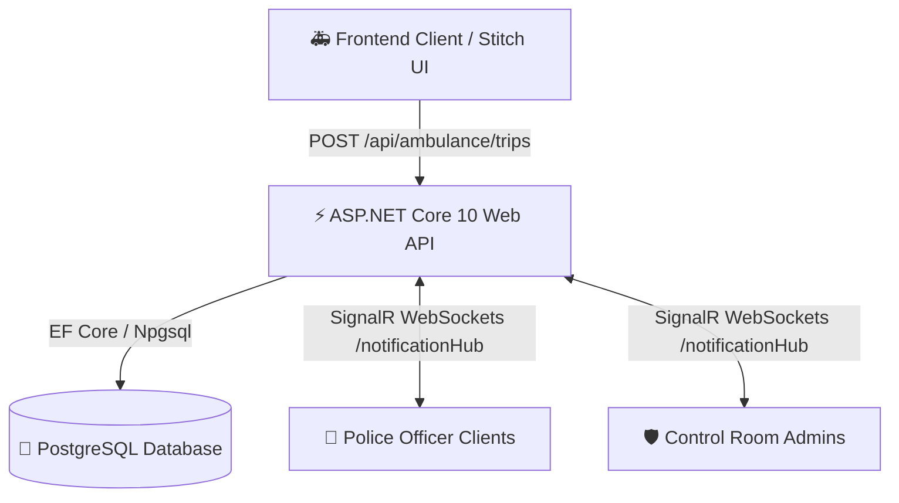

# 🚑 Smart Ambulance Traffic Clearance System - Backend API

> **ASP.NET Core 10 Web API, SignalR WebSockets, PostgreSQL (EF Core), and JWT Role-Based Authentication** for real-time emergency green corridor clearance.

---

## 📌 Solution Overview

The **Smart Ambulance Traffic Clearance System Backend** provides real-time emergency corridor dispatching and signal clearance notification:
1. **Ambulance Crew** creates an emergency trip specifying route locations (*From → To*).
2. **Route Clearance Engine** automatically matches traffic police officers assigned to signal junctions along that route.
3. **SignalR WebSockets Hub (`/notificationHub`)** instantly pushes real-time emergency notifications to targeted traffic police officers and control room admins.
4. **Traffic Police Officers** acknowledge and update clearance status (`Pending` ➔ `Cleared` ➔ `Passed`), pushing instant real-time status updates back to ambulance drivers and admins.

---

## 🏗️ System Architecture



---

## 🛠️ Tech Stack

| Component | Technology |
| :--- | :--- |
| **Framework** | ASP.NET Core 10 Web API |
| **Database** | PostgreSQL 16 (`Npgsql.EntityFrameworkCore.PostgreSQL`) |
| **ORM** | Entity Framework Core (EF Core) |
| **Real-Time Engine** | ASP.NET Core SignalR (WebSockets) |
| **Authentication** | JWT (JSON Web Tokens) with Role Claims (`Ambulance`, `Police`, `Admin`) |
| **API Documentation** | Swagger / OpenAPI v3 (`http://localhost:5000/swagger`) |
| **Containerization** | Docker, Docker Compose |
| **CI/CD** | GitHub Actions Pipeline |

---

## 👥 Seed Account Credentials

| Role | Username | Password | Linked Entity / Signal Location |
| :--- | :--- | :--- | :--- |
| **Ambulance Crew 1** | `ambulance1` | `Password123!` | Reg: KA-01-EQ-9901 |
| **Ambulance Crew 2** | `ambulance2` | `Password123!` | Reg: KA-01-EQ-9902 |
| **Police Officer 1** | `police1` | `Password123!` | Signal-1: Central Hospital & Main Rd Junction |
| **Police Officer 2** | `police2` | `Password123!` | Signal-2: Ring Road & Civil Hospital Cross |
| **System Admin** | `admin` | `Password123!` | Emergency Control Room Monitor |

---

## 🔑 Database Connection String Configuration

### Local Execution (`dotnet run`)
Configured in `backend/appsettings.json`:
```json
"ConnectionStrings": {
  "DefaultConnection": "Host=localhost;Port=5432;Database=ambulancedb;Username=postgres;Password=mahesh12345678@"
}
```

### Docker Compose Execution (`docker compose up`)
Configured in `docker-compose.yml`:
```yaml
POSTGRES_PASSWORD: mahesh12345678@
ConnectionStrings__DefaultConnection: Host=db;Port=5432;Database=ambulancedb;Username=postgres;Password=mahesh12345678@
```

---

## 🚀 How to Run Backend

### Option A: Local CLI Mode (.NET SDK)
```bash
cd backend
dotnet restore
dotnet run
```
*Access Swagger Interactive API Explorer at `http://localhost:5000/swagger`.*

### Option B: Docker Compose
```bash
docker compose up --build -d
```
- **PostgreSQL Database**: `localhost:5432`
- **ASP.NET Core Web API**: `http://localhost:5000`
- **Swagger Documentation**: `http://localhost:5000/swagger`

---

## 📑 Complete API Endpoints & SignalR Events

### 🔑 Authentication
- `POST /api/auth/login`: Accepts `{ username, password }`, returns JWT Bearer token and user profile details.

### 🚑 Ambulance Endpoints (`Authorize: Roles = Ambulance, Admin`)
- `GET /api/ambulance/routes`: Get predefined route options.
- `POST /api/ambulance/trips`: Start emergency trip `{ fromLocation, toLocation }`.
- `GET /api/ambulance/trips/active`: Get active trips for logged-in ambulance crew.
- `GET /api/ambulance/trips/{id}`: Get detailed trip progress and signal timeline.
- `PUT /api/ambulance/trips/{id}/cancel`: Cancel active trip.

### 👮 Police Endpoints (`Authorize: Roles = Police, Admin`)
- `GET /api/police/notifications`: Get signal clearance notifications for logged-in officer.
- `PUT /api/police/notifications/{id}/status`: Update status `{ status: "Cleared" | "Passed" }`.

### 🛡️ Admin Endpoints (`Authorize: Roles = Admin`)
- `GET /api/admin/statistics`: Get overall corridor metrics.
- `GET /api/admin/officers`: Get monitored police officer signal station matrix.

### ⚡ SignalR Real-Time WebSockets (`/notificationHub`)
- **Incoming Events**:
  - `ReceiveEmergencyNotification`: Triggered when an ambulance starts a trip along officer's signal location.
  - `NotificationStatusUpdated`: Triggered when an officer marks signal as `Cleared` or `Passed`.
  - `TripCancelled`: Triggered when an ambulance driver cancels a trip.
