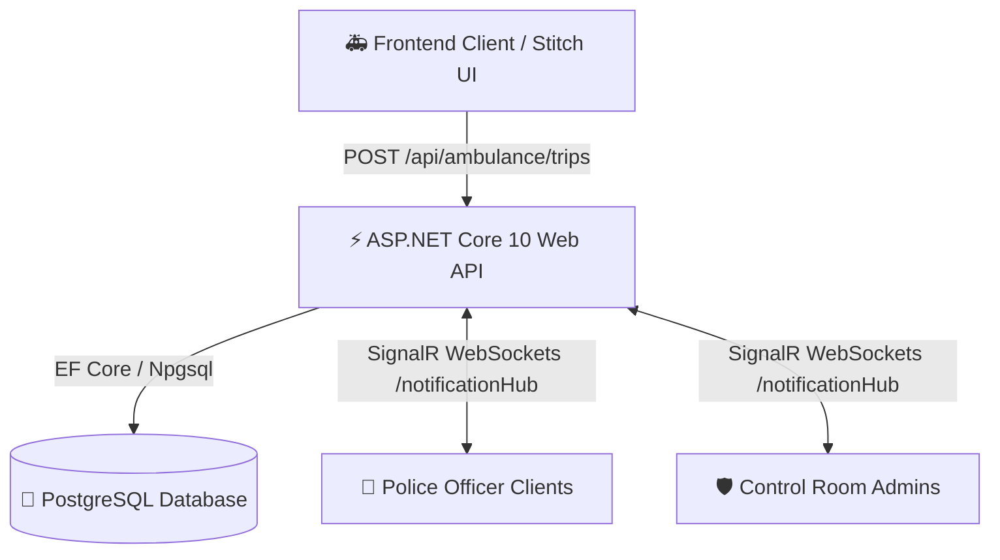

# 🚑 Smart Ambulance Traffic Clearance System - Backend API

> **ASP.NET Core 10 Web API, SignalR WebSockets, PostgreSQL (EF Core), and JWT Role-Based Authentication** for real-time emergency green corridor clearance.

---

## 📌 Solution Overview

The **Smart Ambulance Traffic Clearance System Backend** provides real-time emergency corridor dispatching and signal clearance notification:
1. **Ambulance Crew** creates an emergency trip specifying route locations (*From → To*).
2. **Route Clearance Engine** automatically matches traffic police officers assigned to signal junctions along that route.
3. **SignalR WebSockets Hub (`/notificationHub`)** instantly pushes real-time emergency notifications to targeted traffic police officers and control room admins.
4. **Traffic Police Officers** acknowledge and update clearance status (`Pending` ➔ `Cleared` ➔ `Passed`), pushing instant real-time status updates back to ambulance drivers and admins.

---

## 🏗️ System Architecture



---

## 👥 Seed Account Credentials

| Role | Username | Password | Linked Entity / Signal Location |
| :--- | :--- | :--- | :--- |
| **Ambulance Crew 1** | `ambulance1` | `Password123!` | Reg: KA-01-EQ-9901 |
| **Ambulance Crew 2** | `ambulance2` | `Password123!` | Reg: KA-01-EQ-9902 |
| **Police Officer 1** | `police1` | `Password123!` | Signal-1: Central Hospital & Main Rd Junction |
| **Police Officer 2** | `police2` | `Password123!` | Signal-2: Ring Road & Civil Hospital Cross |
| **System Admin** | `admin` | `Password123!` | Emergency Control Room Monitor |

---

## 🔑 Database Connection String Configuration

### Local Execution (`dotnet run`)
Configured in `backend/appsettings.json`:
```json
"ConnectionStrings": {
  "DefaultConnection": "Host=localhost;Port=5432;Database=ambulancedb;Username=postgres;Password=mahesh12345678@"
}
```

### Docker Compose Execution (`docker compose up`)
Configured in `docker-compose.yml`:
```yaml
POSTGRES_PASSWORD: mahesh12345678@
ConnectionStrings__DefaultConnection: Host=db;Port=5432;Database=ambulancedb;Username=postgres;Password=mahesh12345678@
```

---

## 🚀 How to Run Backend

### Option A: Local CLI Mode (.NET SDK)
```bash
cd backend
dotnet restore
dotnet run
```
*Access Swagger Interactive API Explorer at `http://localhost:5000/swagger`.*

### Option B: Docker Compose
```bash
docker compose up --build -d
```
- **PostgreSQL Database**: `localhost:5432`
- **ASP.NET Core Web API**: `http://localhost:5000`
- **Swagger Documentation**: `http://localhost:5000/swagger`

---

## 🧪 Complete Step-by-Step Swagger Testing Guide (`http://localhost:5000/swagger`)

### Step 1: Login as Ambulance Driver & Copy JWT Token
1. Open **[http://localhost:5000/swagger](http://localhost:5000/swagger)**.
2. Expand **`POST /api/auth/login`** and click **Try it out**.
3. Paste the following JSON request body:
   ```json
   {
     "username": "ambulance1",
     "password": "Password123!"
   }
   ```
4. Click **Execute**.
5. Copy the `"token"` string value from the Response Body (without quotes).
6. Scroll to the top right of the Swagger UI, click **Authorize** 🔓, type `Bearer YOUR_COPIED_TOKEN`, and click **Authorize**.

---

### Step 2: Test Ambulance Endpoints (`/api/ambulance`)

#### 1. `GET /api/ambulance/routes`
- Click **Try it out** ➔ **Execute**.
- **Expected Result**: Returns pre-mapped emergency route options (e.g., `From: Central Hospital` to `To: City Civil Hospital`).

#### 2. `POST /api/ambulance/trips` (Start Emergency Trip)
- Click **Try it out**.
- Paste request body:
  ```json
  {
    "fromLocation": "Central Hospital",
    "toLocation": "City Civil Hospital"
  }
  ```
- Click **Execute**.
- **Expected Result**: Returns HTTP `200 OK` with created trip details (e.g. `"id": 1`) and generated `notifications` array matching signal police officers along that corridor.

#### 3. `GET /api/ambulance/trips/active`
- Click **Try it out** ➔ **Execute**.
- **Expected Result**: Returns the active trip currently in progress for `ambulance1`.

#### 4. `GET /api/ambulance/trips/{id}`
- Set `id`: `1` ➔ Click **Execute**.
- **Expected Result**: Returns detailed trip information and real-time status of each signal junction.

---

### Step 3: Login as Police Officer & Clear Signal Junction

1. Click **Authorize** at the top right of Swagger ➔ Click **Logout** to clear the previous token.
2. Expand **`POST /api/auth/login`**.
3. Paste request body for Police Officer 1:
   ```json
   {
     "username": "police1",
     "password": "Password123!"
   }
   ```
4. Click **Execute** and copy the new JWT `"token"`.
5. Click **Authorize** 🔓, type `Bearer YOUR_POLICE_TOKEN`, and click **Authorize**.

#### 1. `GET /api/police/notifications`
- Click **Try it out** ➔ **Execute**.
- **Expected Result**: Returns active notification list for Officer 1 at `Central Hospital & Main Rd Junction` with `"status": "Pending"`. Note the notification `"id"` (e.g. `1`).

#### 2. `PUT /api/police/notifications/{id}/status` (Mark Junction Cleared)
- Set `id`: `1`
- Paste request body:
  ```json
  {
    "status": "Cleared"
  }
  ```
- Click **Execute**.
- **Expected Result**: Returns updated notification object with `"status": "Cleared"`.

#### 3. `PUT /api/police/notifications/{id}/status` (Mark Ambulance Passed)
- Set `id`: `1`
- Paste request body:
  ```json
  {
    "status": "Passed"
  }
  ```
- Click **Execute**.
- **Expected Result**: Status updates to `"Passed"`, restoring standard signal operation.

---

### Step 4: Login as System Admin & Check Control Room Stats

1. Click **Authorize** ➔ **Logout**.
2. Perform `POST /api/auth/login` with Admin credentials:
   ```json
   {
     "username": "admin",
     "password": "Password123!"
   }
   ```
3. Copy the admin JWT token and authorize via **Authorize** 🔓 (`Bearer YOUR_ADMIN_TOKEN`).

#### 1. `GET /api/admin/statistics`
- Click **Try it out** ➔ **Execute**.
- **Expected Result**: Returns system-wide statistics (`activeTripsCount`, `clearedJunctionsCount`, `totalOfficersCount`, and `activeTrips` list).

#### 2. `GET /api/admin/officers`
- Click **Try it out** ➔ **Execute**.
- **Expected Result**: Returns matrix of all registered traffic police officers and their assigned signal locations.

---

### Step 5: Test Ambulance Cancel Trip

1. Re-authorize as `ambulance1` using the ambulance JWT token.
2. `PUT /api/ambulance/trips/1/cancel`
- Click **Try it out**, set `id`: `1` ➔ Click **Execute**.
- **Expected Result**: Returns HTTP `200 OK` with message `"Trip cancelled successfully."`.

---

## ⚡ Real-Time SignalR WebSockets Hub Specification (`ws://localhost:5000/notificationHub`)

- **Connection URL**: `http://localhost:5000/notificationHub?access_token=YOUR_JWT_TOKEN`
- **SignalR Client Events**:
  - `ReceiveEmergencyNotification`: Payload includes `NotificationResponse` when ambulance starts trip.
  - `NotificationStatusUpdated`: Payload includes updated `NotificationResponse` when status changes (`Pending` ➔ `Cleared` ➔ `Passed`).
  - `TripCancelled`: Payload includes `emergencyTripId` when trip is cancelled.
