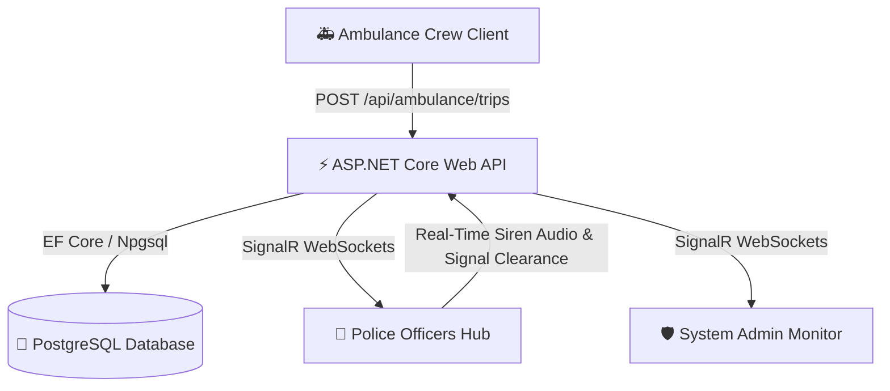

# 🚑 Smart Ambulance Traffic Clearance System

> **A Competition-Ready Real-Time Emergency Route Clearance & Traffic Police Corridor Solution** built with **ASP.NET Core 8/10 Web API**, **SignalR WebSockets**, **PostgreSQL (EF Core)**, and **React (TypeScript + Ant Design)**.

---

## 📌 Problem Statement & Solution Overview

### Problem
In dense urban traffic, emergency ambulances experience life-threatening delays at traffic signal junctions. Although traffic police officers hear approaching sirens, they **cannot identify the direction or exact route of approaching emergency vehicles**, causing critical delays in opening green corridors.

### Solution
The **Smart Ambulance Traffic Clearance System** bridges this communication gap in real time:
1. **Ambulance Crew** initiates an emergency trip selecting their route (*From → To*).
2. **Signal Clearance Engine** instantly matches officers stationed along signal locations on that route.
3. **Traffic Police Officers** receive real-time push alerts with **browser audio sirens**, approaching vehicle registration details, distance, and ETA.
4. **Officers** clear traffic proactively (*Mark Cleared → Mark Passed*), ensuring smooth green corridor progression.
5. **System Admin** monitors overall traffic green corridor performance across all junctions.

---

## 🏗️ System Architecture



---

## 🛠️ Technology Stack

| Domain | Technology / Framework |
| :--- | :--- |
| **Backend** | ASP.NET Core 10 Web API, Entity Framework Core, SignalR WebSockets |
| **Database** | PostgreSQL 16 (`Npgsql.EntityFrameworkCore.PostgreSQL`) |
| **Frontend** | React 18, TypeScript, Vite, Ant Design (Emergency Dark Theme), Lucide Icons |
| **Real-Time Communications** | ASP.NET Core SignalR + `@microsoft/signalr` |
| **Audio Synthesizer** | HTML5 Web Audio API (Dual-oscillator emergency siren frequency sweep) |
| **Authentication** | JWT (JSON Web Tokens) with Role-Based Access Control (`Ambulance`, `Police`, `Admin`) |
| **Containerization** | Docker, Docker Compose, Nginx Reverse Proxy |
| **CI/CD** | GitHub Actions Pipeline |

---

## 👥 Demo Quick Login Credentials

| Role | Username | Password | Linked Entity / Location |
| :--- | :--- | :--- | :--- |
| **Ambulance Crew 1** | `ambulance1` | `Password123!` | Registration: KA-01-EQ-9901 |
| **Ambulance Crew 2** | `ambulance2` | `Password123!` | Registration: KA-01-EQ-9902 |
| **Police Officer 1** | `police1` | `Password123!` | Signal-1: Central Hospital & Main Rd Junction |
| **Police Officer 2** | `police2` | `Password123!` | Signal-2: Ring Road & Civil Hospital Cross |
| **System Admin** | `admin` | `Password123!` | Emergency Control Room Monitor |

---

## 🚀 Quick Start (Docker Compose)

### Prerequisites
- [Docker Desktop](https://www.docker.com/products/docker-desktop/) installed & running.
- [Git](https://git-scm.com/) installed.

### 1. Clone Repository
```bash
git clone https://github.com/maheshwaran6953/Ambulance-Traffic-Clearance-System.git
cd Ambulance-Traffic-Clearance-System
```

### 2. Launch with Docker Compose
```bash
docker compose up --build -d
```

### 3. Access Applications
- 🌐 **Frontend Application**: `http://localhost:8080` (or `http://localhost:5173` in local dev mode)
- ⚡ **Backend Web API & Swagger UI**: `http://localhost:5000/swagger`
- 🐘 **PostgreSQL DB**: `localhost:5432` (`Database=ambulancedb`, `Username=postgres`, `Password=postgres`)

---

## 💻 Local Development Setup (CLI Mode)

### Backend (.NET 10 Web API)
```bash
cd backend
dotnet restore
dotnet run
```
*API runs at `http://localhost:5000`.*

### Frontend (React + Vite)
```bash
cd frontend
npm install
npm run dev
```
*Frontend runs at `http://localhost:5173`.*

---

## 📑 API Endpoints Reference

### Auth Endpoint
- `POST /api/auth/login`: Authenticate user and return JWT bearer token.

### Ambulance Endpoints
- `GET /api/ambulance/routes`: Get predefined emergency route suggestions.
- `POST /api/ambulance/trips`: Start emergency trip & push signal alerts.
- `GET /api/ambulance/trips/active`: Get active trips for driver.
- `GET /api/ambulance/trips/{id}`: Get trip details and signal timeline.
- `PUT /api/ambulance/trips/{id}/cancel`: Cancel active trip.

### Police Endpoints
- `GET /api/police/notifications`: Get active notifications for officer's signal junction.
- `PUT /api/police/notifications/{id}/status`: Update clearance status (`Pending` ➔ `Cleared` ➔ `Passed`).

### Admin Endpoints
- `GET /api/admin/statistics`: Get overall corridor metrics.
- `GET /api/admin/officers`: Get monitored police officers matrix.

---

## 📄 License
This project is licensed under the MIT License.
